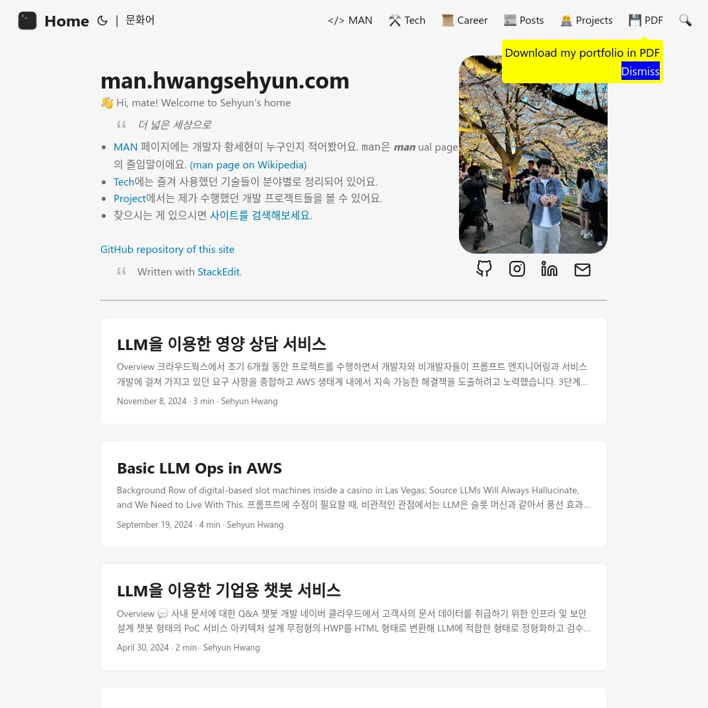

# [man.hwangsehyun.com](https://man.hwangsehyun.com)



## Requirements

### Infrastructure

- [MicroCMS](https://microcms.io/en)
- [Cloudant CouchDB](https://www.ibm.com/products/cloudant) from IBM Cloud
- [StackEdit](https://stackedit.io/)
- [AWS Secrets Manager](https://aws.amazon.com/secrets-manager/) Secret
  - `HUGO_PARAMS_MICROCMS_KEY`
  - `CLOUDANT_APIKEY`

### Tools

- [Hugo](https://gohugo.io/)

	```
	sudo apt install hugo
	sudo dnf install hugo
	brew install hugo
	```

- Node.js, [corepack](https://nodejs.org/api/corepack.html), pnpm

- NPM Libraries

	```sh
	pnpm i
	```

## Develpment

### [Project IDX](https://idx.dev/)

1. [Sign in to AWS Toolkit for VS Code](https://docs.aws.amazon.com/toolkit-for-vscode/latest/userguide/connect.html#connect-to-aws)

1. Download markdown contents from StackEdit

  ```sh
  make stackedit
  ```

### Local

1. Sign in to AWS SSO using AWS CLI

  ```sh
  aws sso login
  ```

1. Download markdown contents from StackEdit

  ```sh
  make stackedit
  ```

1. Start Hugo

  ```
  make hugo
  ```

1. Navigate to <http://localhost:1313>

## Build & Deploy

1. Build site

  ```sh
  make build
  ```

1. Build screenshot and pdf

  ```sh
  make browser -B
  ```

1. Deploy to AWS

  ```sh
  make deploy
  ```
